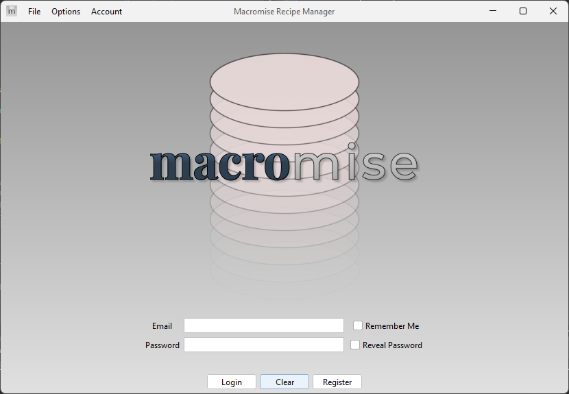
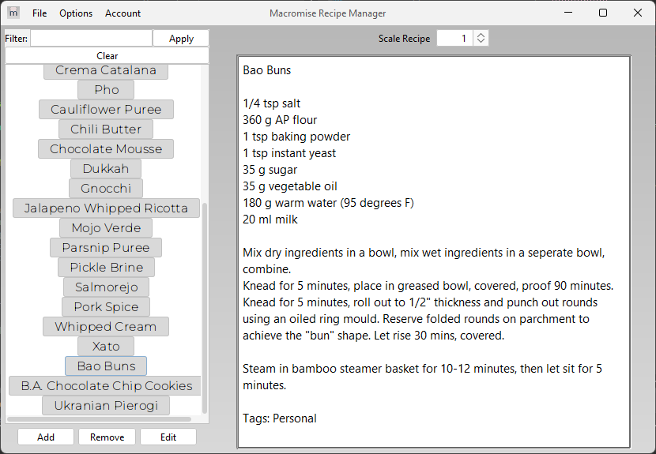

# Macromise Recipe manager




# What this app is for

At its' core, Macromise [macro-MEEZ] is a simple recipe manager that allows multiple users to access the same database of recipes. License holders can use the desktop application to manage recipes, while mobile users connected to the same restaurant database can suggest new recipes or edits to existing ones. The 'administrator' (desktop user) can then either approve or reject these changes.

In this way, multiple members of staff can have the shared responsibility of creating new recipes and maintaining the accuracy of old ones, instead of the executive and sous chef being solely responsible for recipe upkeep.

# Usage

Begin by creating an account through the desktop application. Recipes are tied to your account, and each account has a database tied to it. 

Once logged in, the list of existing recipes will be displayed on the left, while information on any selected recipe will be displayed on the right. 

Buttons for creating, removing, and editing recipes are situated on the bottom left of the screen. 

Recipes can be filtered by name or by their associated tags in the "filter" section above the recipe selection list. Recipes may also be scaled with the scale spinner above the recipe description section.

## Adding New Recipes

To add a new recipe, click the "Add" button below the recipe selection pane. A new dialog will be created that has input areas for title, ingredients, instructions, and tags.

Give the recipe a title, a list of ingredients, and some instructions. You may opt to include tags for your recipes, but they are optional. Helpful uses for tags allow you and your staff to search for recipes by the section(s) that they are associated with; for example: *Garde Manger, Saucier, Entremetier.*

Recipe ingredients must be input in a particular fashion to allow the application to properly parse ingredients and allow for scaling. The proper way to add an ingredient is:

```
[amount] [unit] [ingredient name]

1 1/2 cup flour         // Fractional amounts are fine
0.5 cup sugar           // As are decimal amounts
1 stick butter          // Special units exist for common ingredients (clove, stick, knob)
salt to taste           // ERROR; Program will reject this recipe as there is no unit
```

As you can see from the example above, it may seem like the application is overly particular. However, the only cases where the recipe will be rejected is if one or more ingredients are in the incorrect format, with the most common cause for rejection being **salt**, or **salt, to taste** being at the bottom of most recipes.

In the vast majority of professional kitchens, seasoning with salt is an unwritten step in every recipe, is highly subjective, and is reliant on many factors including the cook's palate. If there is no prescribed "amount" of salt for the associated recipe, just add "season with salt" to the instructions.

# Features

## Auto-Backup

In the options menu item, you can tick the *auto backup* checkbox. This feature will automatically export all recipes stored in the database to a .rcp file on your hard drive; this feature is engaged every time the application closes. 

## Import/export

Recipes can be manually exported to and imported from files in the proprietary .rcp format. This is helpful for migrating recipes from one database to another, or merging the contents of multiple databases into one.

## Languages

Macromise is available in English, French, and German. Additional languages may be added in the future.

### Credit

Cailean Bernard, July 14 2025 - 